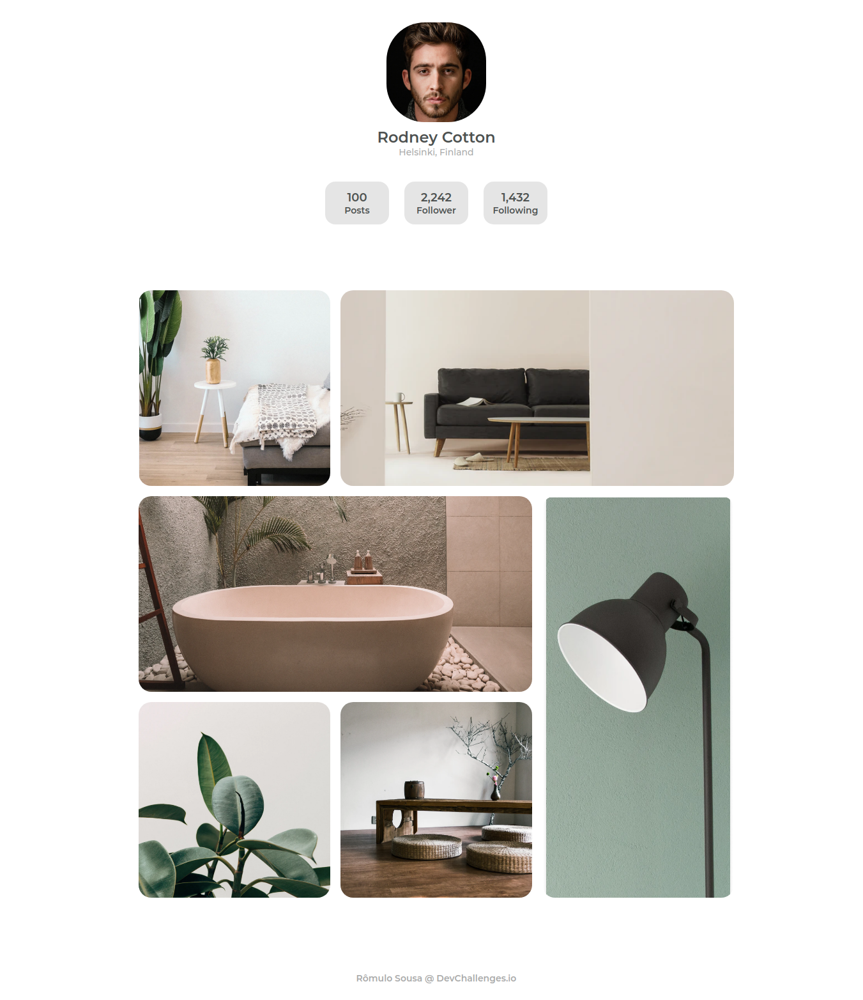

<!-- Please update value in the {}  -->

<h1 align="center">Interior consultant</h1>

   Solution for a challenge from  <a href="http://devchallenges.io" target="_blank">Devchallenges.io</a>.

  <h3>
    <a href="https://devchallengers-my-gallery.vercel.app/">
      Demo
    </a>
     | 
    <a href="https://devchallenges.io/solutions/jkjvZh935fVLCQePxkGb">
      Solution
    </a>
     | 
    <a href="https://devchallenges.io/challenges/Jymh2b2FyebRTUljkNcb">
      Challenge
    </a>
  </h3>

<!-- TABLE OF CONTENTS -->

## Table of Contents

- [Table of Contents](#table-of-contents)
- [Overview](#overview)
- [Built With](#built-with)
- [Contact](#contact)

<!-- OVERVIEW -->

## Overview

Anyway, one more to tell.

In this challenge I enjoyed working with grid layout. And with responsive images

I hope you like it and all comments are welcome.
Thanks!

## Built With

<!-- This section should list any major frameworks that you built your project using. Here are a few examples.-->

- [HTML](https://developer.mozilla.org/pt-BR/docs/Web/HTML/HTML5)
- [CSS](https://developer.mozilla.org/pt-BR/docs/Web/CSS)
- [Javascript](https://developer.mozilla.org/pt-BR/docs/Web/JavaScript)

## Contact

- GitHub [Carmo-sousa](https://github.com/Carmo-sousa)
- Twitter [Metatron_br](https://twitter.com/metatron_br)